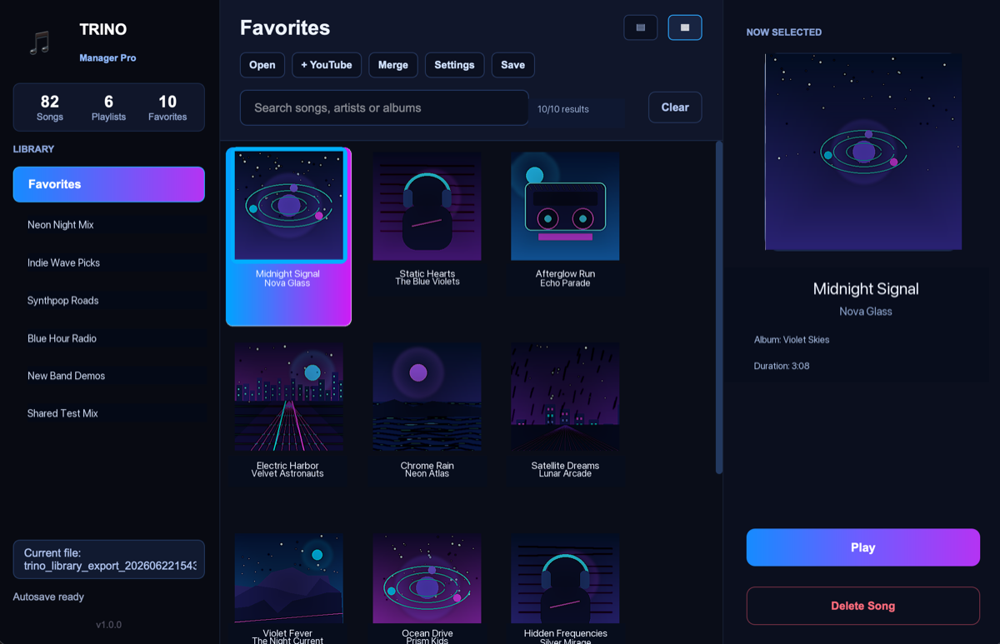

# Trino Manager

Trino Manager is a desktop app for organizing, reviewing, and maintaining backups of Trino libraries. 

This repository is intended to publish ready-to-use packaged releases only.

## Download

Go to the **Releases** section of this repository and download the package for your system:

- **macOS Apple Silicon**: `Trino_Manager.app`
- **Windows**: `Trino_Manager.exe`

## Install on macOS

1. Download the `.app` file from the latest release.
2. Open `Trino Manager.app`.
3. If macOS shows a security warning, right-click the app and choose **Open**.

## Install on Windows

1. Download the Windows `.exe` file from the latest release.
2. Run `Trino_Manager.exe`.
3. If Windows SmartScreen shows a warning, make sure the file comes from this release and choose **More info > Run anyway**.

## What You Can Do

- Open Trino libraries exported as `.zip` or `.json`.
- View favorites and playlists.
- Search songs by title, artist, or album.
- Reorder songs.
- Delete songs.
- Add song references from YouTube.
- Play songs in your web browser.
- Merge another Trino library without losing your changes.
- Save a new modified copy.
- Create separate autosaves without modifying the original file.

## Important

Trino Manager works with library metadata. It does not include music, audio files, credentials, cookies, or private account data.

## Recommendation

Before making major changes, keep a copy of the original ZIP exported from Trino.

## Support

If you find a problem, open an issue and include:

- Operating system.
- Downloaded version.
- Which file you were trying to open.
- What you expected to happen.
- What actually happened.

[LICENSES_USED](THIRD_PARTY_NOTICES.md)                        
[TRINO_MANAGER_LICENSE](LICENSE)
